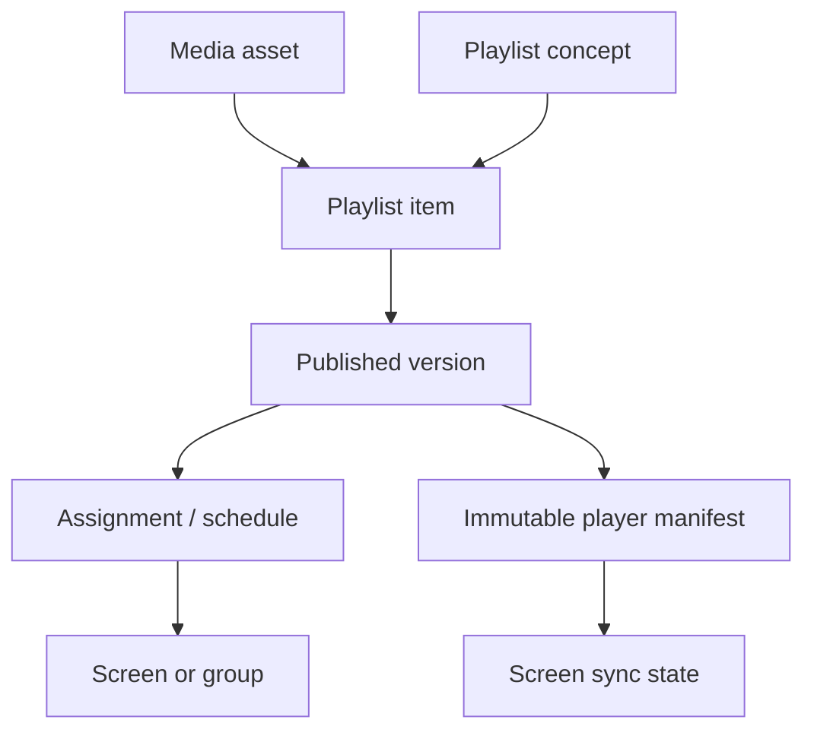

# VeyoCast Publisher & Tenant Backoffice Canon v1.0

**Status:** bindend ontwerp-, architectuur- en uitvoeringsdocument  
**Product:** VeyoCast  
**Werkgebied:** tenant-admin/backoffice, VeyoCast Publisher en mobiele beheer-PWA  
**Referentie:** de door opdrachtgever meegestuurde VeyoCast Publisher-mock-up(s)  
**Doelgroep van dit document:** Codex-hoofdagent, eventuele subagents, reviewers en menselijke acceptatietesters  

---

## 0. Zo gebruik je dit document

Lever aan Codex in één taak:

1. dit volledige canon;
2. alle VeyoCast Publisher-referentieafbeeldingen;
3. toegang tot de actuele `veyocast/platform`-repository en de relevante branch;
4. indien van toepassing: bestaande technische, product- en designcanons.

Gebruik daarna deze korte startinstructie:

> Voer het bijgevoegde **VeyoCast Publisher & Tenant Backoffice Canon v1.0** volledig uit in de actuele VeyoCast-repository. Lees eerst alle repository-instructies en inventariseer de bestaande architectuur, routes, schema’s, componenten, tests en playercontracten. Behandel de meegestuurde mock-up als bindende visuele bron. Bouw de interface als echte, herbruikbare Radix UI/shadcn/ui-componenten; gebruik de afbeelding nooit als gerasterde UI of pagina-achtergrond. Pas het uiterlijk van de volledige tenant-backoffice consistent aan en realiseer Publisher end-to-end met echte data, rechten, versiepublicatie, synchronisatiestatus, responsive gedrag en PWA-geschiktheid. Stop niet na analyse of planning: implementeer, migreer, test, visueel verifieer en rapporteer bewijs volgens dit canon. Behoud bestaande werkende functionaliteit en playercompatibiliteit. Stel alleen een vraag bij een echte blokkade die niet veilig uit repositorycontext kan worden opgelost.

Dit canon is bewust uitgebreider dan één sprintprompt. Codex moet het als één gecontroleerde productmissie behandelen, met tussentijdse checkpoints en een aantoonbare Definition of Done.

---

# Deel I — Missie, bronhiërarchie en scope

## 1. Productmissie

Maak van de VeyoCast tenant-backoffice een hoogwaardige, bijzonder gebruiksvriendelijke publicatieomgeving voor narrowcasting. Een beheerder moet zonder technische kennis in enkele handelingen:

- schermen en schermgroepen kunnen beheren;
- media kunnen uploaden, organiseren, controleren, dupliceren en vervangen;
- visuele playlists kunnen samenstellen en herschikken;
- de duur en presentatie van ieder playlist-item direct kunnen aanpassen;
- content kunnen previewen voor scherm, datum, tijd en oriëntatie;
- een concept veilig kunnen publiceren;
- kunnen zien wat live staat, waarom dit live staat en op welke schermen;
- de distributie- en synchronisatiestatus kunnen volgen;
- planningen, overrides, versies en rollbacks kunnen beheren;
- dezelfde hoofdhandelingen prettig kunnen uitvoeren op telefoon en tablet.

De ervaring moet aanvoelen als een rustige combinatie van een moderne media-editor, Spotify-achtige playlistbediening en een betrouwbare enterprise control room. De interface is visueel en direct, maar blijft voorspelbaar, toegankelijk en veilig.

## 2. Bindende bronhiërarchie

Bij conflicten geldt deze volgorde:

1. expliciete opdracht van de gebruiker in de actuele taak;
2. dit canon;
3. meegestuurde referentieafbeeldingen, waarbij de meest routespecifieke afbeelding voorrang heeft;
4. repository-instructies zoals `AGENTS.md`, voor zover deze niet conflicteren met 1 of 2;
5. bestaande VeyoCast product-, security- en architectuurcanons;
6. bestaande implementatie en conventies;
7. eigen technische aannames.

### 2.1 Betekenis van “exact overnemen”

“Exact” betekent:

- dezelfde visuele hiërarchie;
- dezelfde donkere sidebar en actieve navigatiebehandeling;
- dezelfde lichte werkruimte;
- dezelfde paneelverdeling van de playlist-editor;
- dezelfde compacte kaartdichtheid;
- dezelfde type iconografie;
- dezelfde headeropbouw, statusweergave en primaire acties;
- dezelfde oranje, zwarte, witte en neutrale kleurrollen;
- dezelfde visuele behandeling van thumbnails, sleepgrepen, duurstepper, badges, borders en selectie;
- dezelfde mobiele informatievolgorde en vaste onderste acties;
- een aantoonbaar consistente vertaling naar alle tenant-backofficepagina’s.

“Exact” betekent niet:

- de monitor, telefoonbehuizing, tafel of fotografische studioscène nabouwen;
- foutieve of toevallige tekst uit een AI-mock-up letterlijk kopiëren;
- de referentieafbeelding als pagina-achtergrond gebruiken;
- interacties faken met statische afbeeldingen;
- toegankelijkheid, leesbaarheid of bestaande productlogica opofferen;
- alle breakpoints forceren in één vaste pixelmaat.

Alle zichtbare UI moet native, semantisch en functioneel worden geïmplementeerd.

## 3. Scope

### 3.1 Binnen scope

- volledige visuele herziening van de **tenant-admin/backoffice**;
- uniforme app-shell, navigatie, headers, containers, cards, tabellen, formulieren, dialogen, lege toestanden en feedback;
- Publisher-overzicht;
- schermen en schermgroepen;
- playlists en de centrale playlist-editor;
- mediabibliotheek en uploadflow;
- planning;
- templates als gecontroleerde contentflow;
- activiteit, audit en versiegeschiedenis;
- publicatie, distributie en synchronisatiestatus;
- desktop, tablet, mobiel web en installeerbare PWA;
- rechten en tenantisolatie;
- tests, migraties, documentatie, visuele QA en releasebewijs.

### 3.2 Buiten scope, tenzij de huidige repository dit al als gedeeld onderdeel vereist

- redesign van de publieke marketingwebsite;
- redesign van de daadwerkelijke fullscreen playerweergave;
- redesign van de platform-admin van DG Webservices;
- nieuwe native Android- of iOS-codebase;
- een volledige vrije Canva-kloon;
- wijzigingen aan abonnementslogica of prijsmodellen die niet nodig zijn voor Publisher;
- nieuwe externe integraties die niet al in de opdracht of repository staan.

Gedeelde componenten mogen worden aangepast wanneer dat nodig is, maar voorkom dat het tenant-redesign onbedoeld platform-admin, player of marketing breekt.

## 4. Niet-onderhandelbare productregels

1. **Media is herbruikbaar.** Het originele mediabestand staat los van plaatsingen in playlists.
2. **Instellingen horen bij het playlist-item.** Duur, overgang, uitsnede, volume en planning mogen per plaatsing verschillen.
3. **Bewerken gebeurt in een concept.** Live schermen draaien nooit rechtstreeks op een mutable concept.
4. **Iedere publicatie is onveranderlijk.** Publiceren maakt een nieuwe versie met een volledige momentopname.
5. **Rollback maakt een nieuwe versie.** Historie wordt nooit overschreven.
6. **De UI vertelt altijd wat live staat.** Toon playlist, versie, herkomst van toewijzing en synchronisatiestatus.
7. **Drag-and-drop is een versnelling, niet de enige bediening.** Iedere sleepactie heeft een toetsenbord- en menu-alternatief.
8. **Mobiel is een eigen compositie.** Geen verkleinde driepanelen-desktopeditor.
9. **Geen nepfunctionaliteit.** Geen knoppen zonder implementatie, hardcoded statistieken of lokale demo-arrays in productiecode.
10. **Geen regressie van bestaande playercontracten.** Bestaande gekoppelde schermen moeten veilig blijven werken.
11. **Alle tenantdata is tenant-gescheiden.** Database, API, realtime en storage moeten dezelfde grens afdwingen.
12. **Publiceren vereist serverbevestiging.** Een offline of mislukte mutatie mag nooit als live worden gepresenteerd.

---

# Deel II — Verplichte repositoryanalyse vóór implementatie

## 5. Discovery-checkpoint

Codex voert eerst een korte maar grondige, read-only inventarisatie uit. Dit is geen eindresultaat; na de inventarisatie moet de implementatie direct doorgaan.

### 5.1 Lees en inventariseer

- alle relevante `AGENTS.md`-bestanden;
- package manager, monorepostructuur en workspacegrenzen;
- Next.js-versie, App Router-structuur en renderingpatronen;
- Tailwind-, shadcn/ui-, Radix- en iconconfiguratie;
- bestaande design tokens, fonts en brandingassets;
- tenant-adminroutes en layouts;
- platform-admin-, player- en marketinggrenzen;
- auth, rollen, permissies en tenantresolutie;
- Supabase-schema’s, migraties, RLS, storagebuckets en realtimegebruik;
- bestaande screen-, media-, playlist-, planning- en publication-entiteiten;
- huidige API-routes, server actions, services en repositorylagen;
- player manifest-, cache-, heartbeat- en synchronisatiecontracten;
- bestaande tests, Storybook of visualisatiepagina’s;
- PWA-manifest, service worker en installability;
- bestaande feature flags en release/deployprocessen;
- huidige lint-, typecheck-, test- en buildcommando’s.

### 5.2 Verplichte nulmeting

Leg vóór wijzigingen vast:

- `git status`;
- actieve branch en HEAD-SHA;
- bestaande failures in lint, typecheck, tests en build;
- route-inventaris van alle tenant-adminpagina’s;
- overzicht van reeds aanwezige Publisher-functionaliteit;
- overlap tussen bestaande datamodellen en dit canon;
- risico’s voor playercompatibiliteit.

Maak geen claims dat een fout door deze taak is veroorzaakt wanneer die aantoonbaar al in de nulmeting bestond.

### 5.3 Beslissingen na discovery

Codex moet daarna:

- bestaande bruikbare modellen en componenten uitbreiden in plaats van dupliceren;
- routepaden behouden wanneer wijziging geen functioneel voordeel heeft;
- één canonieke component- en servicelaag kiezen;
- migraties voor bestaande data achterwaarts compatibel maken;
- huidige playerprotocollen behouden of gecontroleerd versioneren;
- een korte interne route- en componentmatrix maken voor uitvoering en acceptatie.

Stel geen cosmetische keuzevragen. Alleen een onoplosbare blokkade, ontbrekende toegang, incompatibele geheime sleutel of destructieve databeslissing mag het werk onderbreken.

---

# Deel III — Visueel ontwerpcanon

## 6. Ontwerprichting

De backoffice is een lichte, rustige werkruimte binnen een donkere, hoogwaardige navigatieschil.

Kernwoorden:

- premium;
- modern Europees SaaS;
- compact maar niet krap;
- tactiel en visueel;
- betrouwbaar;
- media-first;
- begrijpelijk voor vrijwilligers;
- professioneel genoeg voor enterprise-beheer.

De referentieafbeelding is de primaire visuele bron. Onderstaande tokens maken die richting reproduceerbaar over alle routes.

## 7. Basistokens

Gebruik CSS-variabelen als canonieke bron en map deze naar Tailwind/shadcn-tokens. Als de repository al een tokenlaag heeft, migreer gecontroleerd in plaats van een tweede systeem ernaast te bouwen.

| Rol | Token | Richtwaarde |
|---|---|---:|
| Merkzwart | `--brand-ink` | `#0A0A0A` |
| Sidebar | `--sidebar` | `#121416` |
| Sidebar verhoogd | `--sidebar-elevated` | `#1B1E21` |
| Sidebar actieve rij | `--sidebar-active` | `#24272A` |
| Primair oranje | `--brand-orange` | `#FF5C20` |
| Oranje hover | `--brand-orange-hover` | `#E94D14` |
| Oranje zachte achtergrond | `--brand-orange-soft` | `#FFF1EB` |
| Signaalblauw | `--signal-blue` | `#315CFF` |
| Appachtergrond | `--app-bg` | `#F4F5F6` |
| Werkvlak | `--surface` | `#FFFFFF` |
| Subtiel werkvlak | `--surface-subtle` | `#FAFAFA` |
| Border | `--border` | `#E2E5E8` |
| Sterkere border | `--border-strong` | `#CBD0D5` |
| Primaire tekst | `--text` | `#151719` |
| Secundaire tekst | `--text-muted` | `#666C73` |
| Tertiaire tekst | `--text-subtle` | `#90969D` |
| Succes | `--success` | `#22A447` |
| Waarschuwing | `--warning` | `#D98B13` |
| Fout | `--danger` | `#D64545` |
| Informatie | `--info` | `#315CFF` |

Richtwaarden mogen alleen licht worden aangepast wanneer contrastmetingen, bestaande brandingassets of een aantoonbaar betere match met de originele bron dit vereisen. Leg zo’n aanpassing centraal vast, niet per pagina.

### 7.1 Radius, border en schaduw

- kleine bediening: radius `6px`;
- input, compact button en chip: `7–8px`;
- card en editoritem: `9–10px`;
- grote container/dialog/sheet: `12px`;
- geen overmatig “bubble”-ontwerp;
- standaard border: 1px neutraal grijs;
- standaard shadow: zeer subtiel, bijvoorbeeld `0 1px 2px rgba(10,10,10,.04)`;
- zwevende mobile sheets en dialogen mogen een diepere maar zachte schaduw hebben;
- geselecteerde items gebruiken een blauwe outline/ring en niet alleen een blauwe achtergrond.

### 7.2 Afstanden

Gebruik een 4px-basisschaal:

- `4`: microafstand;
- `8`: controls en inline-elementen;
- `12`: compacte cardinhoud;
- `16`: normale cardinhoud;
- `20`: paneelpadding;
- `24`: paginapadding;
- `32`: sectieafstand;
- `40–48`: grote desktopsecties.

Desktop is compact. Mobiel krijgt minimaal 16px horizontale paginapadding en aanraakdoelen van ten minste 44×44px.

## 8. Typografie

Gebruik de bestaande merkfont als die aantoonbaar is vastgelegd. Anders: `Inter`, `Geist Sans` of de reeds aanwezige moderne grotesk. Introduceer niet meerdere nieuwe fontfamilies.

| Gebruik | Richtwaarde |
|---|---|
| Pagina H1 | 24–30px, 650–700 |
| Editor/paneel H2 | 18–22px, 650–700 |
| Cardtitel | 14–16px, 600–650 |
| Body | 14px desktop, 15–16px mobiel |
| Metadata | 12–13px |
| Badge | 11–12px, 550–650 |
| Button | 13–14px, 600 |

Regels:

- vermijd overal hoofdletters;
- houd titels kort;
- gebruik Nederlandse interfacetekst;
- gebruik tabular numbers voor duur, tijden, versies en opslagcijfers;
- laat lange media- en playlistnamen netjes ellipsen met volledige naam in toegankelijke context;
- gebruik niet uitsluitend tooltips voor noodzakelijke informatie.

## 9. Iconografie

Gebruik één consistente lijniconenset, bij voorkeur de al aanwezige `lucide-react`.

- standaardmaat navigatie: 18–20px;
- inline bediening: 16–18px;
- lege toestand: 28–40px;
- strokewidth circa 1.75–2;
- geen mix van gevulde emoji, willekeurige SVG’s en meerdere iconlibraries;
- icon-only buttons hebben `aria-label`, focusring en tooltip op desktop;
- statusiconen worden altijd gecombineerd met tekst of toegankelijke naam.

Voorbeelden:

- overzicht: `Home`;
- schermen: `Monitor`;
- playlists: `ListVideo`;
- media: `Image`;
- planning: `CalendarDays`;
- templates: `FileStack`;
- activiteit: `Activity`;
- upload: `CloudUpload`;
- publiceren: `Upload` of `Send`;
- synchronisatie: `RefreshCw`;
- sleepgreep: `GripVertical`;
- contextmenu: `MoreVertical`.

## 10. Desktop app-shell

### 10.1 Hoofdstructuur

De desktoplayout bestaat uit:

1. vaste donkere sidebar;
2. lichte topbar binnen de werkruimte;
3. paginawerkvlak;
4. optionele onderliggende statusrail in editorcontext;
5. geen dubbele of concurrerende navigaties.

Richtmaten:

- sidebar: circa 208–232px, afhankelijk van bestaande viewport en logo;
- topbar: 64–72px;
- standaard page padding: 20–28px;
- editor kan het beschikbare viewport volledig gebruiken;
- sidebar en editor mogen onafhankelijk scrollen waar nodig.

### 10.2 Sidebar

Neem de mock-up als bindende bron:

- diepzwarte/donkerantraciete achtergrond;
- VeyoCast-logo bovenaan, met witte `Veyo` en oranje `Cast`;
- ruime merkzone;
- navigatie-items op één lijn met links een lijnicoon;
- witte of lichtgrijze labels;
- actieve rij met donker verhoogd vlak;
- 3–4px verticale oranje accentlijn links;
- actief icoon en eventueel labelaccent in oranje;
- hover subtiel lichter, zonder harde glow;
- onderste zone voor tenantwissel, account, support en instellingen indien aanwezig;
- ingeklapte toestand alleen wanneer de repository dit ondersteunt of de viewport dit vereist.

Sidebar-items voor Publisher:

- Overzicht;
- Schermen;
- Schermgroepen;
- Playlists;
- Media;
- Planning;
- Templates;
- Activiteit.

Aanvullende bestaande backoffice-items blijven bestaan, maar krijgen exact dezelfde styling.

### 10.3 Topbar

De topbar toont routeafhankelijk:

- breadcrumb of terugnavigatie links;
- paginatitel/context;
- globale zoek- of commandfunctie wanneer bestaand;
- opslagstatus;
- undo/redo in de editor;
- secundaire actie `Voorbeeld`;
- primaire oranje actie `Publiceren`;
- account/tenantacties waar van toepassing.

Geen overvolle header. Minder belangrijke acties gaan in een duidelijk contextmenu.

## 11. Tabletgedrag

Voor circa 768–1199px:

- sidebar wordt een compacte rail of toegankelijke drawer;
- paginacontainers blijven maximaal twee kolommen;
- playlist-editor houdt de playlist centraal;
- mediabibliotheek en iteminstellingen openen als sheet/drawer;
- primaire acties blijven zichtbaar;
- tabellen kunnen gecontroleerd horizontaal scrollen, maar belangrijke mobiele data wordt als card vertaald;
- alle controls blijven touchvriendelijk.

## 12. Mobiele app-shell en PWA

De mobiele referentie is bindend:

- donkere appachtergrond;
- compacte donkere header met terugknop, titel, opslagstatus en contextmenu;
- lichte playlistcards boven een donker canvas;
- vaste actiebalk vlak boven de hoofdnavigatie;
- vaste onderste navigatie met vijf primaire bestemmingen;
- actieve bestemming in oranje;
- respecteer `safe-area-inset-top` en `safe-area-inset-bottom`;
- geen desktopsidebar op mobiele breedte.

Primaire bottomnav:

1. Home;
2. Schermen;
3. Playlists;
4. Media;
5. Meer.

Editor-actiebalk:

- Media;
- Preview;
- Publiceren.

Een destructieve actie komt nooit als primaire vaste actie.

## 13. Containers, cards en paginadichtheid

Alle backofficepagina’s krijgen hetzelfde oppervlaktesysteem:

- appachtergrond lichtgrijs;
- hoofdcontainers wit;
- subtiele 1px-border;
- ingetogen radius;
- minimaal schaduwgebruik;
- duidelijke headers met titel, metadata en acties;
- geen eindeloze verzameling identieke statistiekcards;
- thumbnails en echte statusinformatie zijn visueel belangrijker dan decoratie.

### 13.1 Card-anatomie

Een standaard card bestaat uit:

1. optionele media/icoonzone;
2. titel;
3. korte metadata;
4. status;
5. maximaal één primaire inline actie;
6. contextmenu voor overige acties.

### 13.2 Tabellen

- sticky header bij lange tabellen;
- compacte rijhoogte zonder onder 44px touchhoogte te komen op mobiel;
- checkboxkolom voor bulkselectie;
- sorteerstatus zichtbaar;
- filters als chips/popover;
- row actions in dropdown;
- lege toestand binnen dezelfde container;
- belangrijke tabellen krijgen cardweergave op mobiel.

### 13.3 Formulieren

- labels boven controls;
- hulptekst onder de control;
- fouttekst direct bij het veld;
- duidelijke disabled- en loadingtoestand;
- switches alleen voor echt binair gedrag;
- datum/tijd altijd met tenanttijdzone en expliciete notatie;
- autosave alleen wanneer toestand duidelijk wordt getoond.

## 14. Statussysteem

Kleur is nooit de enige informatiedrager.

| Status | Visuele rol |
|---|---|
| Online / volledig actief | groen puntje + tekst |
| Offline / fout | rood icoon/puntje + tekst |
| Waarschuwing | amber icoon + tekst |
| Synchroniseren | blauw roterend/sync-icoon + tekst |
| Concept | neutrale grijze badge |
| Gewijzigd sinds publicatie | oranje zachte badge |
| Gepubliceerd | groen of blauw met tekst |
| Gearchiveerd | neutraal, lager contrast |

Maak één centrale statusbadgecomponent en één centrale formattering voor scherm- en publicatiestatus.

---

# Deel IV — Informatiestructuur en routecanon

## 15. Publisher-informatiestructuur

```text
Publisher
├── Overzicht
├── Schermen
│   └── Schermdetail
├── Schermgroepen
│   └── Groepsdetail
├── Playlists
│   ├── Playlistdetail/editor
│   ├── Preview
│   └── Versiegeschiedenis
├── Media
│   ├── Mediabibliotheek
│   └── Mediadetail/editor
├── Planning
├── Templates
└── Activiteit
```

Codex mag bestaande routepaden behouden. Deze boom beschrijft functies en navigatie, niet verplicht de letterlijke URL’s.

## 16. Volledige dashboardconsistentie

De redesignopdracht eindigt niet bij Publisher. Codex moet iedere bestaande tenant-adminroute inventariseren en in een verificatiematrix opnemen.

Voor elke bestaande route moet minimaal zijn aangepast:

- app-shell;
- sidebar;
- paginaheader;
- achtergrond en max-width;
- cards/containers;
- buttons;
- inputs;
- tables/listen;
- tabs;
- badges;
- dialogen/sheets;
- loading, empty, error en permission states;
- responsive gedrag.

Geen pagina mag zichtbaar achterblijven in de oude stijl, tenzij die route buiten tenant-admin valt. In dat geval wordt dit expliciet in de eindrapportage vermeld.

## 17. Publisher-overzicht

Het overzicht is operationeel, niet decoratief.

### 17.1 Bovenste statuszone

Vier compacte, klikbare kaarten:

- Schermen online: bijvoorbeeld `12 van 14`;
- Publicatie gereed: aantal niet-gepubliceerde concepten;
- Synchronisatie: verouderde of gedeeltelijk gesynchroniseerde schermen;
- Opslag: gebruikt ten opzichte van tenantlimiet.

Iedere kaart opent een relevante gefilterde view.

### 17.2 Primaire acties

- Nieuwe playlist;
- Media uploaden;
- Scherm koppelen;
- Planning maken.

### 17.3 Nu actief

Toon:

- actieve playlist(s);
- gekoppelde schermen;
- huidige content;
- eerstvolgende wijziging;
- publicatieversie;
- synchronisatiedekking.

### 17.4 Aandacht nodig

Alleen actiegerichte signalen:

- scherm offline;
- verwerking mislukt;
- verlopen item;
- concept nog niet gepubliceerd;
- scherm op oude versie;
- cache/download onvolledig;
- conflict in planning;
- ontbrekende fallback.

### 17.5 Recente activiteit

Toon begrijpelijke, geactoriseerde regels, bijvoorbeeld:

> Danny publiceerde “Wedstrijddag” versie 14 naar 6 schermen.

## 18. Schermenoverzicht

Standaard cardweergave, optioneel tabel.

Iedere schermcard toont:

- naam;
- locatie;
- preview of laatst bekende screenshot;
- online/offline;
- laatste contact;
- actieve playlist;
- actieve versie;
- reden van toewijzing;
- synchronisatiestatus;
- resolutie en oriëntatie;
- waarschuwing indien relevant.

Filters:

- online;
- offline;
- ongekoppeld;
- synchronisatie vereist;
- waarschuwing;
- locatie;
- groep;
- playlist;
- oriëntatie.

Bulkacties:

- playlist toewijzen;
- aan groep toevoegen;
- planning wijzigen;
- synchronisatieverzoek;
- herstartverzoek indien backend dit ondersteunt;
- instellingen toepassen;
- exporteren.

## 19. Schermdetail

Tabs:

1. Overzicht;
2. Content;
3. Planning;
4. Gezondheid;
5. Instellingen;
6. Activiteit.

### 19.1 Overzicht

- actuele of laatst bekende preview;
- status en laatste heartbeat;
- huidige playlist en versie;
- download/cachevoortgang;
- opslagstatus;
- eerstvolgende geplande content;
- player/appversie als secundaire technische informatie.

### 19.2 Content

- playlist koppelen of wijzigen;
- tijdelijke override;
- direct één boodschap tonen;
- actieve publicatie inspecteren;
- doorklik naar editor;
- zichtbaar verklaren waarom content actief is.

### 19.3 Gezondheid

Gebruik begrijpelijke labels:

- Verbinding;
- Content gedownload;
- Opslag;
- Player actief;
- Laatste contact.

Technische details staan ingeklapt onder “Technische gegevens”.

## 20. Schermgroepen

Ondersteun organisatorische groepen zoals:

- Kantine;
- Kleedkamers;
- Bestuurskamer;
- Sponsorwand;
- Alle schermen;
- Toernooiweekend.

Een scherm mag in meerdere groepen zitten wanneer het huidige model dit veilig ondersteunt. Contentprioriteit is altijd verklaarbaar:

1. nood- of directe override;
2. individuele schermplanning;
3. schermgroepsplanning;
4. standaardplaylist van het scherm;
5. tenant-fallback.

De UI toont bijvoorbeeld:

> Actief via schermgroep “Kantine”.

## 21. Playlists-overzicht

Iedere playlistcard of -rij toont:

- samengestelde thumbnail;
- naam;
- aantal items;
- totale duur;
- gekoppelde schermen;
- status;
- laatste wijziging;
- eerstvolgende planning;
- eventuele waarschuwingen.

Statussen:

- Concept;
- Gepubliceerd;
- Gewijzigd sinds publicatie;
- Ingepland;
- Gearchiveerd;
- Bevat waarschuwingen.

Weergaven:

- kaarten;
- tabel;
- mappen;
- favorieten;
- recent.

Acties:

- openen;
- preview;
- dupliceren;
- publiceren;
- planning;
- scherm koppelen;
- naam wijzigen;
- verplaatsen;
- archiveren;
- versiegeschiedenis.

## 22. Mediabibliotheek

Ondersteun, voor zover player en backend dit toelaten:

- afbeeldingen;
- video;
- PDF-pagina’s als gerenderde schermcontent;
- webcontent;
- tekstslides;
- templates;
- integratiecontent.

Iedere mediacard toont:

- thumbnail/poster;
- naam;
- type;
- resolutie/formaat;
- duur voor video;
- verwerkingsstatus;
- gebruiksaantal;
- laatste wijziging.

Organisatie:

- mappen;
- tags;
- favorieten;
- recent;
- ongebruikt;
- verlopen;
- door mij geüpload;
- gedeelde merkmedia.

## 23. Planning

Ondersteun:

- eenmalig;
- dagelijks;
- wekelijks;
- specifieke weekdagen;
- periode;
- tijdvenster;
- handmatig activeren;
- bestaande domeinspecifieke gebeurtenissen wanneer al aanwezig.

Weergaven:

- tijdlijn;
- week;
- maand;
- per scherm;
- per schermgroep.

Conflicten worden vóór opslaan zichtbaar met:

- betrokken schermen;
- conflicterende periode;
- bestaande bron;
- voorgestelde opties.

Geen verborgen prioriteit.

## 24. Templates

Templates zijn gecontroleerde contentvormen, geen vrije designcanvas.

Voorbeelden:

- Wedstrijden vandaag;
- Uitslagen;
- Kantinemenu;
- Sponsor in beeld;
- Activiteit aangekondigd;
- Welkom bij de club;
- Training afgelast;
- Vrijwilligers gezocht;
- Noodmelding.

Bewerkbaar:

- tekstvelden;
- afbeelding/logo;
- toegestane merkkleuren;
- beperkte typografische varianten;
- liggende en staande preview.

Niet toestaan:

- willekeurige absolute positioning zonder grenzen;
- onbegrensde fontmaten;
- onleesbare contrastcombinaties;
- output die niet door de player wordt ondersteund.

## 25. Activiteit

Filterbare auditweergave voor:

- uploads;
- mediawijzigingen;
- playlistwijzigingen;
- publicaties;
- rollbacks;
- schermkoppelingen;
- planningen;
- overrides;
- verwijderingen;
- permissiongevoelige acties.

Toon actor, tijd, tenanttijdzone, object, actie, resultaat en relevante versie.

---

# Deel V — De centrale playlist-editor

## 26. Bindende desktopcompositie

De referentieafbeelding toont de gewenste editor:

```text
┌──────────────┬─────────────────────────────────────────────────────────────┐
│ Donkere      │ Breadcrumb   Opslagstatus   Undo/Redo  Preview  Publiceren │
│ sidebar      ├───────────────┬────────────────────────┬────────────────────┤
│              │ Media         │ Playlist/storyboard    │ Iteminstellingen   │
│              │ bibliotheek   │                        │                    │
│              │               │                        │                    │
│              ├───────────────┴────────────────────────┴────────────────────┤
│              │ Online status   Versie   Synchronisatiestatus              │
└──────────────┴─────────────────────────────────────────────────────────────┘
```

Desktopgrid:

- linkerpaneel circa 27–29%;
- middenpaneel circa 48–51%;
- rechterpaneel circa 21–24%;
- tussenruimte circa 12px;
- panelen als witte bordered containers;
- middenpaneel krijgt voorrang bij smallere desktopbreedte.

Gebruik resizable panels alleen wanneer dit stabiel, persistent en toegankelijk kan. De referentieverhouding blijft de standaard.

## 27. Editorheader

Links:

- terug/breadcrumb `Playlists / Wedstrijddag`;
- titel waar relevant.

Rechts:

- undo;
- redo;
- groene status `Opgeslagen`;
- secundaire knop `Voorbeeld`;
- primaire oranje knop `Publiceren`.

Opslagstatussen:

- Opgeslagen;
- Bezig met opslaan;
- Opslaan mislukt;
- Offline gewijzigd;
- Niet-gepubliceerde wijzigingen.

Autosave moet debounced, conflictbewust en serverbevestigd zijn.

## 28. Linkerpaneel: mediabibliotheek

Exacte informatievolgorde:

1. paneeltitel `Mediabibliotheek`;
2. zoekveld;
3. filterchips, minimaal Alles, Afbeeldingen, Video;
4. compact thumbnailgrid;
5. uploaddropzone;
6. optioneel aanvullende filters/mappen via popover of paneelnavigatie.

Gedrag:

- drag media naar playlist;
- multi-select;
- contextmenu;
- hover op desktop, tapselectie op touch;
- lazy loading en virtualisatie bij grote bibliotheken;
- uploadvoortgang blijft zichtbaar terwijl gebruiker doorwerkt;
- dubbele bestanden detecteren op hash waar mogelijk.

## 29. Middenpaneel: storyboard

Header:

- playlistnaam;
- aantal items;
- totale duur;
- badge `Concept` of live status.

Iedere itemrij bevat:

1. sleepgreep;
2. volgnummer;
3. thumbnail/poster;
4. titel;
5. type en overgang;
6. inline duurstepper;
7. contextmenu;
8. waarschuwing/status wanneer nodig.

Geselecteerde rij:

- duidelijke blauwe border/focusring;
- geen verlies van contrast;
- iteminstellingen verschijnen rechts.

### 29.1 Duurstepper

Voor afbeeldingen:

```text
[ − ]  8 sec  [ + ]
```

Gedrag:

- minus/plus wijzigt één seconde;
- vasthouden versnelt;
- klik/tap op waarde opent exact veld;
- presets 5, 8, 10, 15 en 30 seconden;
- minimum en maximum server-side én client-side valideren;
- wijziging werkt live door in totale duur;
- bulkduur voor multiselect.

Voor video:

- standaard werkelijke duur;
- optioneel begin- en eindpunt;
- geen langere duur dan bron tenzij herhalen expliciet is ingeschakeld;
- video-origineel blijft ongewijzigd.

### 29.2 Secties

Lange playlists ondersteunen secties:

- inklappen;
- als geheel verplaatsen;
- tijdelijk uitschakelen;
- eigen standaardduur;
- eigen overgang;
- opslaan als herbruikbaar blok.

De speler ontvangt uiteindelijk een deterministisch lineair manifest.

### 29.3 Invoegindicator

Tijdens drag-and-drop:

- heldere oranje of blauwe lijn;
- ronde plusindicator zoals in de mock-up;
- auto-scroll;
- geldige en ongeldige dropzones;
- geen drag naar prullenbak.

## 30. Rechterpaneel: iteminstellingen

Wanneer een item is geselecteerd:

- titel en mediaverwijzing;
- grotere preview;
- duur;
- overgang;
- weergave `Vullen`, `Passend`, eventueel `Bijsnijden`;
- focuspunt of crop;
- achtergrondkleur;
- volume/mute voor video;
- begin- en eindpunt;
- itemplanning;
- toegankelijkheidsnaam;
- dupliceren;
- vervangen;
- verwijderen.

Wanneer de playlist zelf is geselecteerd:

- naam;
- beschrijving;
- standaardduur afbeeldingen;
- standaardovergang;
- herhaalgedrag;
- achtergrond;
- fallback;
- gekoppelde schermen.

Op tablet/mobiel wordt dit paneel een sheet of aparte pagina.

## 31. Onderste statusrail

Zoals in de referentie:

- links: `12 / 14 schermen online`;
- midden: actieve/publicatieversie;
- rechts: synchronisatiestatus.

Deze statusrail:

- is contextueel;
- gebruikt echte data;
- is klikbaar voor detail;
- wordt niet getoond wanneer geen schermkoppeling bestaat;
- heeft een toegankelijke mobiele vertaling in een compact statusblok.

## 32. Undo, redo en concurrency

Ondersteun:

- undo/redo voor lokale editoracties;
- autosave na coherente wijziging;
- optimistic update met rollback bij fout;
- versie- of revisiontoken om lost updates te voorkomen;
- melding wanneer een andere beheerder hetzelfde concept heeft gewijzigd;
- keuze om nieuwste versie te laden of conflicten gecontroleerd te verwerken.

Undo mag geen al gepubliceerde historische versie wijzigen.

## 33. Dupliceren en vervangen

Maak het onderscheid expliciet.

### 33.1 Playlist-item dupliceren

Kopieert:

- mediaverwijzing;
- duur;
- overgang;
- crop/focus;
- planning;
- volume;
- overige iteminstellingen.

### 33.2 Mediabestand dupliceren

Alleen wanneer een onafhankelijke assetkopie werkelijk nodig is.

### 33.3 Media vervangen

Bied:

- alleen dit playlist-item;
- overal in deze playlist;
- in alle playlists.

Bij impact buiten het huidige item:

- voer eerst gebruiksanalyse uit;
- toon aantallen en namen;
- vereis expliciete bevestiging;
- registreer auditinformatie;
- behoud herstelbaarheid.

## 34. Preview

Preview moet de playersemantiek zo nauw mogelijk volgen.

Ondersteun:

- schermverhouding;
- liggend/staand;
- overgang;
- video;
- werkelijke duur;
- datum/tijdsimulatie;
- planning;
- safe areas;
- schermselectie;
- volledig scherm;
- 1×, 2× en 4×;
- vorig/volgend;
- direct naar item;
- tijdlijn.

Waar architectonisch haalbaar deelt preview dezelfde manifestparser/renderlogica als de player. Voorkom een tweede afwijkende implementatie.

## 35. Publicatievenster

Voor publicatie:

- playlistnaam;
- aantal items;
- totale duur;
- gekoppelde schermen;
- overzicht van wijzigingen;
- verwerkingsstatus van media;
- waarschuwingen;
- directe of geplande publicatie;
- impact op actieve schermen.

Voorbeeld:

```text
Publiceer “Wedstrijddag”

8 items · totale duur 2:14
Wordt gebruikt op 6 schermen

Wijzigingen:
+ 2 items toegevoegd
− 1 item verwijderd
~ 3 duren aangepast

Waarschuwing:
Eén afbeelding heeft een lage resolutie.
```

Een waarschuwing blokkeert alleen bij echte incompatibiliteit of securityrisico.

## 36. Publicatiestatus

Ondersteun en toon:

- Concept;
- Publicatie voorbereiden;
- Media verwerken;
- Klaar voor distributie;
- Wordt gesynchroniseerd;
- Gedeeltelijk gesynchroniseerd;
- Volledig actief;
- Publicatie mislukt.

De UI mag “Volledig actief” pas tonen wanneer de vastgelegde synchronisatiecriteria zijn gehaald.

---

# Deel VI — Mobiele editor en PWA

## 37. Mobiele editorflow

De mobiele playlist-editor is opgesplitst:

1. Playlistitems;
2. Media toevoegen;
3. Iteminstellingen;
4. Preview;
5. Publiceren.

Header:

- terug;
- playlistnaam;
- opslagstatus;
- meer-menu.

Vaste actiebalk:

- Media;
- Preview;
- Publiceren.

Bottomnav blijft daaronder zichtbaar, behalve in immersive preview of een expliciete modalflow.

## 38. Mobiele itemcard

De referentie bepaalt:

- lichte card op donkere achtergrond;
- sleepgreep links;
- volgnummer;
- thumbnail;
- titel;
- inline duurstepper;
- contextmenu rechts;
- geselecteerde card met blauwe outline;
- minimaal 44px touch targets;
- truncatie zonder informatieverlies.

Gedrag:

- tik opent instellingen;
- lang indrukken op greep start verplaatsen;
- contextmenu biedt `Omhoog`, `Omlaag`, `Verplaats naar…`, `Dupliceren`, `Vervangen`, `Verwijderen`;
- swipe mag versnellen maar bevat geen exclusieve functionaliteit;
- haptische feedback alleen wanneer de PWA/native wrapper dit veilig ondersteunt.

## 39. Mobiele quick actions

In enkele tikken:

- foto maken/uploaden;
- media aan playlist toevoegen;
- duur wijzigen;
- sponsoritem dupliceren;
- preview;
- publiceren;
- schermstatus controleren;
- synchronisatieverzoek;
- tijdelijke melding/override;
- noodcontent, alleen met passende rechten.

## 40. Offline en slechte verbinding

Minimaal:

- app-shell cache;
- laatst bekeken metadata;
- duidelijke offline-indicator;
- lokaal concept als herstelbuffer;
- mutation queue met idempotency keys;
- hervatbare upload indien backend/storage dit ondersteunt;
- conflictcontrole bij reconnect;
- serverbevestiging vóór publicatiestatus.

Voorkom het cachen van gevoelige tenantdata buiten de noodzakelijke scope. Maak cachebeleid expliciet en wis tenantgebonden data bij logout of tenantwissel.

## 41. PWA-installability

Verifieer:

- geldig manifest;
- VeyoCast-iconen inclusief maskable variant;
- juiste theme/background colors;
- standalone display;
- service worker lifecycle;
- updateprompt;
- offline fallback;
- veilige HTTPS-aanname;
- geen kritieke mobile viewportbugs;
- iOS/Android safe areas;
- deel-/camera-upload alleen wanneer ondersteund, met nette fallback.

---

# Deel VII — Domeinmodel en backendcontracten

## 42. Conceptueel model



## 43. Kernentiteiten

Pas dit aan op het bestaande schema. Dupliceer geen reeds bestaande domeinen.

### 43.1 Media

`media_assets`

- id;
- tenant_id;
- storage/object reference;
- original filename;
- display name;
- MIME/type;
- bytes;
- checksum;
- width/height;
- duration;
- orientation/aspect ratio;
- processing status;
- poster/thumbnail references;
- metadata;
- created_by;
- created_at/updated_at;
- archived/deleted timestamps.

Aanvullend waar nodig:

- `media_variants`;
- `media_folders`;
- `media_tags`;
- `media_asset_tags`;
- `media_processing_jobs`.

### 43.2 Playlists

`playlists`

- id;
- tenant_id;
- naam;
- beschrijving;
- draft revision;
- current published version id;
- defaults;
- status;
- created_by/updated_by;
- timestamps;
- archived/deleted timestamps.

`playlist_sections`

- id;
- playlist_id;
- order key;
- naam;
- enabled;
- defaults.

`playlist_items`

- id;
- playlist_id;
- section_id;
- media_asset_id of typed content reference;
- stable order key;
- duration;
- transition;
- display mode;
- crop/focus;
- background;
- volume/mute;
- trim;
- item schedule/visibility;
- enabled;
- metadata;
- revision timestamps.

Gebruik een rang-/orderstrategie die herschikken zonder volledige renumbering ondersteunt, tenzij de bestaande architectuur bewust anders werkt.

### 43.3 Publicatie

`playlist_versions`

- id;
- playlist_id;
- integer version number per playlist;
- immutable snapshot/manifest reference;
- checksum;
- change summary;
- published_by;
- published_at;
- publication status.

`playlist_version_items` wanneer relationele snapshots nodig zijn, of een streng gevalideerd immutable manifest als dit beter past bij de playerarchitectuur.

### 43.4 Schermen en groepen

- `screens`;
- `screen_groups`;
- `screen_group_members`;
- `screen_assignments`;
- `screen_heartbeats`;
- `screen_sync_states`;
- `screen_commands`, alleen wanneer bestaande player dit ondersteunt.

### 43.5 Planning

- `content_schedules`;
- target type/id;
- playlist/version reference;
- recurrence;
- timezone;
- start/end;
- priority/source;
- enabled;
- conflict metadata.

### 43.6 Activiteit

- `audit_events`;
- tenant;
- actor;
- action;
- entity type/id;
- before/after of veilige diff;
- request/correlation id;
- timestamp;
- result.

Bewaar geen secrets, grote binaire data of onnodige persoonsgegevens in auditpayloads.

## 44. Data-integriteit

Databaseconstraints moeten minimaal borgen:

- tenantrelaties kunnen niet over tenants heen verwijzen;
- playlist-item verwijst naar geldige media binnen dezelfde tenant;
- versienummer is uniek per playlist;
- gepubliceerde snapshot is immutable;
- duration/trim is geldig;
- planningsperiode is logisch;
- soft-deleted assets kunnen niet ongemerkt nieuw worden toegevoegd;
- publicatie met onvoltooide incompatibele media wordt geblokkeerd;
- schermsync verwijst naar een bekende version/checksum.

## 45. RLS en serverautorisatie

RLS is verplicht waar Supabase direct toegankelijk is. Daarnaast controleert de server:

- authenticated user;
- actieve tenant;
- permissie;
- objecttenant;
- doelstatus;
- impact van bulkactie;
- idempotency voor kritieke mutaties.

De client is nooit autoritatief voor tenant_id, role of publication state.

## 46. Rechten

Minimale permissionmatrix:

- Publisher bekijken;
- Media uploaden;
- Media bewerken;
- Media archiveren/verwijderen;
- Playlists maken;
- Playlists bewerken;
- Playlists publiceren;
- Schermen beheren;
- Schermgroepen beheren;
- Planning beheren;
- Directe overrides;
- Noodoverride;
- Versies herstellen;
- Activiteitenlog bekijken.

Voorbeeldrollen:

- Viewer;
- Contentmaker;
- Publisher;
- Schermbeheerder;
- Tenantbeheerder.

Een gebruiker kan content voorbereiden zonder publicatierecht.

## 47. API/servicecontracten

Gebruik de bestaande servicestijl. Houd domeinlogica uit Reactcomponenten.

Minimale capabilities:

- list/search/filter media;
- create upload session;
- finalize/process media;
- list/create/update/archive playlist;
- reorder/move/duplicate playlist items;
- autosave met revisioncheck;
- previewmanifest genereren;
- publication preflight;
- publish version;
- list/diff/restore versions;
- screen/group assignment;
- schedule create/update/conflict check;
- heartbeat/sync status uitlezen;
- audit activity.

Kritieke mutaties zijn:

- transactioneel;
- idempotent waar retry mogelijk is;
- getraceerd met correlation id;
- voorzien van begrijpelijke foutcodes;
- niet afhankelijk van client-side volgorde alleen.

## 48. Publicatiepipeline

1. laad actueel concept met revision;
2. valideer rechten en tenant;
3. valideer alle playlist-items;
4. controleer mediaverwerking;
5. flatten secties naar lineaire volgorde;
6. materialiseer defaults naar expliciete playerinstellingen;
7. maak deterministisch manifest;
8. bereken checksum;
9. schrijf immutable versie in transactie;
10. wijs versie toe of activeer planning;
11. stuur bestaande distributie-/realtimeprikkel;
12. volg screen acknowledgement/download/cache;
13. toon gedeeltelijke of volledige synchronisatie.

Publicatie van hetzelfde idempotencyverzoek mag geen dubbele versie opleveren.

## 49. Playercompatibiliteit

Codex moet het bestaande playercontract eerst documenteren en daarna:

- bestaande manifestvelden behouden;
- nieuwe velden backward compatible en versioned toevoegen;
- playerverwachtingen met contracttests vastleggen;
- oude actieve versies leesbaar houden;
- migratie van bestaande playlists testen;
- cache- en fallbackgedrag niet stilzwijgend wijzigen;
- nooit UI-status “gesynchroniseerd” afleiden uit alleen een databasewrite.

---

# Deel VIII — Upload, media en verwerking

## 50. Uploadflow

Ondersteun:

- drag-and-drop;
- bestandskiezer;
- bulk;
- telefooncamera/fotobibliotheek;
- voortgang per bestand;
- verwerking na upload;
- retry;
- annuleren waar veilig;
- doorgaan met werken tijdens upload.

Statussen:

- Klaar om te uploaden;
- Uploaden;
- Verwerken;
- Thumbnail maken;
- Gereed;
- Waarschuwing;
- Mislukt.

## 51. Validatie

Waarschuw of blokkeer gecontroleerd bij:

- niet-ondersteund formaat;
- niet-ondersteunde codec;
- te groot bestand;
- lage resolutie;
- afwijkende aspect ratio;
- zeer lange video;
- ontbrekende poster;
- onverwachte transparantie;
- beschadigd bestand;
- dubbele inhoud.

Maak onderscheid tussen:

- blokkade;
- waarschuwing;
- informatieve suggestie.

## 52. Media-editor

Afbeelding:

- crop;
- rotatie;
- focuspunt;
- vullen/passend;
- achtergrondkleur;
- veilige zone;
- oriëntatiespecifieke uitsnede waar ondersteund.

Video:

- posterframe;
- trim;
- mute/volume;
- rotatie;
- vullen/passend;
- transcodingstatus.

Bewaar waar mogelijk playlist-specifieke presentatie als iteminstelling en laat het origineel intact.

## 53. Verwijderen en herstel

- standaard soft delete/archive;
- voer gebruiksanalyse uit;
- blokkeer definitieve verwijdering als actieve publicaties het asset nodig hebben, tenzij een expliciet veilig migratiepad bestaat;
- bied herstel;
- audit;
- verwijder storage pas volgens gecontroleerd retentionbeleid.

---

# Deel IX — Componentarchitectuur

## 54. Verplichte herbruikbare componenten

Namen mogen aansluiten op repositoryconventies, maar conceptueel zijn nodig:

### 54.1 Shell

- `TenantAdminShell`;
- `TenantSidebar`;
- `TenantTopbar`;
- `MobileBottomNav`;
- `PageHeader`;
- `EditorStatusRail`;
- `TenantSwitcher` indien bestaand.

### 54.2 Algemene UI

- `StatusBadge`;
- `EmptyState`;
- `ErrorState`;
- `PermissionState`;
- `LoadingSkeleton`;
- `FilterBar`;
- `BulkActionBar`;
- `ResponsiveDataView`;
- `ConfirmImpactDialog`;
- `AutosaveIndicator`.

### 54.3 Publisher

- `ScreenCard`;
- `ScreenHealthSummary`;
- `PlaylistCard`;
- `PlaylistEditorShell`;
- `MediaLibraryPanel`;
- `MediaCard`;
- `UploadQueue`;
- `PlaylistStoryboard`;
- `PlaylistSection`;
- `PlaylistItemRow`;
- `DurationStepper`;
- `ItemInspector`;
- `PlaylistInspector`;
- `PublishDialog`;
- `PreviewPlayer`;
- `VersionHistory`;
- `ScheduleConflictDialog`.

## 55. Radix UI/shadcn/ui-patronen

Gebruik:

- `Dialog` voor belangrijke flows;
- `AlertDialog` voor destructieve bevestiging;
- `Sheet` voor tablet/mobile inspector;
- `Drawer` voor mobiele media- en filterflows;
- `DropdownMenu` voor itemacties;
- `ContextMenu` op desktop;
- `Popover` voor snelle duur/planning;
- `Tabs` voor schermdetails;
- `Command` voor zoeken/koppelen;
- `Tooltip` aanvullend;
- `Toast` voor korte bevestiging;
- `Progress` voor upload en sync;
- `Skeleton`;
- `Badge`;
- `ScrollArea`;
- `ResizablePanel` alleen indien passend;
- `Collapsible` voor secties;
- `Checkbox` voor bulk;
- `Switch` alleen bij begrijpelijke boolean.

Voeg geen tweede UI-kit toe.

## 56. Drag-and-droptechniek

Gebruik de al aanwezige toegankelijke sortable-oplossing. Als geen geschikte oplossing bestaat, heeft `@dnd-kit` de voorkeur boven HTML5-only drag-and-drop.

Vereisten:

- pointer;
- touch;
- toetsenbord;
- duidelijke drag overlay;
- collision strategy;
- auto-scroll;
- multi-select of expliciet uitgestelde support;
- optimistische UI met rollback;
- server-side ordervalidatie;
- screenreaderaankondigingen;
- alternatief via menu.

---

# Deel X — Toegankelijkheid, kwaliteit en performance

## 57. Toegankelijkheid

Streef minimaal naar WCAG 2.2 AA:

- contrast;
- zichtbare focus;
- volledige toetsenbordbediening;
- geen color-only status;
- semantische headings;
- labels en descriptions;
- live regions voor upload/autosave waar nuttig;
- dialog focus trap en restore;
- reduced motion;
- grote touch targets;
- drag-and-dropalternatieven;
- consistente foutmeldingen.

## 58. Motion

Motion ondersteunt begrip:

- 120–200ms voor hover/open/close;
- 180–250ms voor list reordering;
- subtiele fade/slide;
- geen theatrale dashboardanimaties;
- respecteer `prefers-reduced-motion`;
- publicatie- en uploadvoortgang mag functioneel animeren.

## 59. Performancebudget

Doelen, aangepast aan repositorymogelijkheden:

- geen volledige mediabibliotheek in één onbegrensde DOM;
- lazy thumbnails;
- juiste image sizing;
- virtualiseer grote lijsten;
- debounce zoeken en autosave;
- voorkom N+1-query’s;
- serverpaginate schermen, media, activiteit en versies;
- laad zware preview/editorcode routegericht;
- geen Base64-media in database of Reactstate;
- voorkom onnodige rerenders tijdens drag;
- behoud bruikbaarheid bij honderden media-items en lange playlists.

## 60. Observability

Gebruik bestaande logging/telemetrie:

- upload failure;
- processing failure;
- publication failure;
- sync latency;
- manifest validation failure;
- schedule conflict;
- permission denied;
- client autosave failure.

Geen gevoelige URLs, tokens of persoonsgegevens in logs.

---

# Deel XI — Testcanon

## 61. Unit tests

Minimaal:

- duurvalidatie;
- trimvalidatie;
- order/reordering;
- sectieflattening;
- assignmentprioriteit;
- schedule conflict;
- manifestdeterminisme;
- checksum;
- permissionguards;
- versiondiff;
- autosave conflict;
- statusmapping.

## 62. Integratietests

Minimaal:

- upload → verwerken → media zichtbaar;
- playlist maken → items toevoegen → reorder → autosave;
- item dupliceren;
- itemgericht vervangen;
- impactanalyse bij globaal vervangen;
- preflight → publiceren → version record;
- schermtoewijzing;
- heartbeat/syncstatus;
- schedule overlap;
- rollback als nieuwe versie;
- cross-tenant toegang geweigerd;
- soft delete en restore.

## 63. End-to-endtests

Kritieke journeys:

### Journey A — Eerste publicatie

1. tenantbeheerder logt in;
2. uploadt afbeelding en video;
3. maakt playlist;
4. sleept media in volgorde;
5. wijzigt afbeeldingsduur;
6. previewt;
7. koppelt scherm;
8. publiceert;
9. ziet versie en synchronisatiestatus.

### Journey B — Mobiele snelle wijziging

1. opent PWA;
2. opent playlist;
3. maakt/uploadt foto;
4. voegt toe;
5. verplaatst zonder drag via menu;
6. wijzigt duur;
7. previewt;
8. publiceert;
9. ontvangt serverbevestiging.

### Journey C — Veilige rollback

1. opent versiegeschiedenis;
2. vergelijkt versies;
3. herstelt oude versie als concept;
4. publiceert nieuwe versie;
5. historie blijft intact.

### Journey D — Planningconflict

1. plant playlist op schermgroep;
2. creëert overlappende individuele planning;
3. ziet conflict en prioriteit;
4. kiest expliciete oplossing;
5. simulatie toont resultaat.

### Journey E — Rechten

1. contentmaker bewerkt concept;
2. contentmaker ziet geen uitvoerbare publicatieactie;
3. publisher publiceert;
4. beide acties staan correct in audit.

## 64. Visuele regressie

Maak screenshots op minimaal:

- desktop 1440×900;
- brede desktop 1920×1080;
- tablet 1024×768;
- mobiel 390×844;
- mobiel 430×932.

Verifieer:

- sidebar;
- algemene dashboardpagina;
- schermen;
- playlists;
- editor zonder selectie;
- editor met itemselectie;
- upload;
- publish dialog;
- mobile editor;
- loading/empty/error.

Vergelijk editor en mobiele weergave expliciet met de aangeleverde referentie. Kleine responsive afwijkingen zijn toegestaan; visuele identiteit en informatiehiërarchie niet.

## 65. Verplichte kwaliteitscommando’s

Gebruik de repository-eigen commando’s voor:

- format check;
- lint;
- typecheck;
- unit/integration tests;
- E2E;
- production build;
- migration/schema checks;
- dependency/security check indien bestaand.

Los nieuwe failures op. Rapporteer bestaande failures apart met bewijs uit de nulmeting.

---

# Deel XII — Uitvoeringsplan

## 66. Fase 0 — Audit en veilige baseline

Resultaat:

- route- en architectuurmatrix;
- nulmeting;
- schema-/playercontractanalyse;
- implementatievolgorde;
- identificatie van gedeelde componenten.

Ga daarna direct door.

## 67. Fase 1 — Design foundation en volledige app-shell

- tokens;
- font/iconconsistentie;
- desktop sidebar;
- topbar;
- mobile bottomnav;
- containers;
- buttons/forms/tables;
- algemene states;
- shell uitrollen naar alle tenant-adminroutes.

Checkpoint:

- alle routes gebruiken dezelfde shell;
- geen oude sidebar of afwijkende basiscontainer;
- visuele screenshot van kernroutes.

## 68. Fase 2 — Publisher foundation

- navigatie;
- overzicht;
- schermen en detail;
- schermgroepen;
- mediabibliotheek;
- uploadqueue;
- playlists-overzicht;
- echte data en permissions.

## 69. Fase 3 — Playlist-editor

- driepanelen desktop;
- mobile step flow;
- storyboard;
- drag-and-drop;
- duurstepper;
- iteminspector;
- secties;
- autosave;
- undo/redo;
- previewbasis.

## 70. Fase 4 — Publicatie en synchronisatie

- preflight;
- immutable versions;
- manifest;
- assignments;
- distributietrigger;
- screen acknowledgements;
- syncstatus;
- version history;
- rollback.

## 71. Fase 5 — Planning en professionele workflows

- planning;
- conflictanalyse;
- bulkacties;
- impactanalyse;
- audit/activity;
- uitgebreid filteren;
- templateflow.

## 72. Fase 6 — PWA en offlinebestendigheid

- responsive/mobile polish;
- manifest/service worker;
- local recovery;
- uploadresume indien ondersteund;
- offline status;
- camera/file flows;
- installabilitytests.

## 73. Fase 7 — Consistency sweep en releasehardening

- alle tenant-adminroutes nalopen;
- route matrix aftekenen;
- accessibility;
- performance;
- visual regression;
- tests;
- migratiecontrole;
- build;
- documentatie;
- release- en rollbacknotities.

## 74. Optionele parallelle uitvoering

Wanneer Codex subagents mag gebruiken, werk alleen met begrensde, niet-overlappende tracks. De hoofdagent blijft eigenaar van architectuur, integratie, migrationsvolgorde en eindverificatie.

Aanbevolen tracks na fase 0:

| Track | Werk | Afhankelijkheid |
|---|---|---|
| A | Design tokens, app-shell, algemene componenten | route-inventaris |
| B | Publisher schema, services, permissions, versioning | schema/playeraudit |
| C | Schermen, media, uploads en overzichtspagina’s | A-contracten + B-API |
| D | Playlist-editor, DnD, preview en mobiel | A-componenten + B-services |

Regels:

- geen twee agents wijzigen hetzelfde bestand zonder afstemming;
- iedere track krijgt expliciete paden en acceptatiecriteria;
- migrations worden centraal gesequenced;
- hoofdagent reviewt diffs;
- integratietests draaien pas na gecontroleerde samenvoeging;
- subagents mogen het canon niet reduceren tot alleen hun deel.

---

# Deel XIII — Release, migratie en backward compatibility

## 75. Migraties

- maak voorwaartse, reviewbare migraties;
- geen destructieve rename zonder backfill/compatibiliteitsperiode;
- backfill bestaande playlists en media;
- voeg constraints pas toe nadat bestaande data is gevalideerd;
- test op lege én bestaande database;
- leg rollbackstrategie vast;
- pas RLS/policies mee aan;
- controleer storage policies.

## 76. Feature rollout

Gebruik bestaande feature-flaginfrastructuur wanneer beschikbaar:

- nieuwe shell eventueel tenant- of environmentgericht activeren;
- editor achter flag totdat publicatiecontract is gevalideerd;
- oude actieve content blijft afspeelbaar;
- geen dubbele writepaden langer dan noodzakelijk;
- telemetry gebruiken om fouten te detecteren.

Maak geen nieuw flagsysteem als het product al een patroon heeft.

## 77. Releasebewijs

Eindrapport bevat:

- branch en eind-SHA;
- veranderde hoofdmodules;
- migrations;
- route matrix;
- screenshots;
- uitgevoerde tests met resultaat;
- playercompatibiliteitsbewijs;
- PWA-verificatie;
- bekende beperkingen;
- veilige deployvolgorde;
- rollbackpad.

---

# Deel XIV — Definition of Done

## 78. Functionele Definition of Done

De taak is pas voltooid wanneer:

- een beheerder echte media kan uploaden;
- verwerking/status zichtbaar is;
- een playlist met echte data kan worden gemaakt;
- items kunnen worden toegevoegd, verplaatst, gedupliceerd, vervangen en verwijderd;
- afbeeldingsduur inline kan worden gewijzigd;
- instellingen per playlist-item worden opgeslagen;
- preview werkt;
- concept automatisch en veilig wordt opgeslagen;
- publicatie een immutable versie maakt;
- playlist aan scherm/groep kan worden gekoppeld;
- synchronisatiestatus echte playerdata gebruikt;
- versiegeschiedenis en rollback werken;
- planningconflicten zichtbaar zijn;
- permissionverschillen werken;
- audit is vastgelegd;
- mobiele kernjourney werkt;
- bestaande playerfunctionaliteit niet is gebroken.

## 79. Visuele Definition of Done

- volledige tenant-backoffice gebruikt donkere sidebar;
- VeyoCast-branding is correct;
- actieve navigatie heeft oranje accent;
- headers, containers, iconen en cards zijn consistent;
- Publisher-editor volgt de referentiecompositie;
- desktop toont drie panelen;
- mobiel volgt de donkere referentielayout met lichte cards;
- bottom action bar en bottomnav werken;
- geen route toont zichtbaar het oude design;
- empty/loading/error/permission states passen bij het nieuwe systeem;
- screenshots zijn visueel beoordeeld op alle vastgelegde viewports.

## 80. Technische Definition of Done

- lint/typecheck/build groen, behoudens aantoonbare pre-existing failures;
- relevante unit-, integration- en E2E-tests groen;
- schema en RLS gecontroleerd;
- geen cross-tenant datalek;
- geen secrets in clientbundle/logs;
- geen hardcoded demo-data in productiepad;
- geen onbereikbare knoppen;
- geen rasterized fake UI;
- geen ernstige accessibility issues;
- geen kritieke regressie in playermanifest;
- migratie en rollback gedocumenteerd.

---

# Deel XV — Verboden shortcuts

Codex mag niet:

- alleen een plan opleveren;
- stoppen na één fraaie editorpagina;
- de rest van het dashboard in oude stijl laten;
- referentiebeeld als achtergrond of grote screenshot gebruiken;
- UI bouwen met niet-functionele demo-elementen;
- bestaande businesslogica vervangen door mocks;
- media-instellingen op het globale asset zetten wanneer ze itemgebonden horen;
- concept direct live maken;
- historische versies muteren;
- synchronisatie claimen zonder player acknowledgement;
- tenant_id uit de client vertrouwen;
- mobiele desktoppanelen simpelweg verkleinen;
- drag-and-drop als enige verplaatsmethode aanbieden;
- een tweede design system of iconlibrary introduceren;
- bestaande repositoryinstructies negeren;
- brede, onnodige refactors uitvoeren buiten de scope;
- gebruikerswijzigingen of ongerelateerde worktreechanges overschrijven;
- destructieve databaseacties uitvoeren zonder gecontroleerde migratie.

---

# Deel XVI — Acceptatiechecklist voor menselijke review

## 81. Visuele review

- [ ] Donkere sidebar matcht de referentie.
- [ ] Logo, oranje accent en actieve navigatie zijn correct.
- [ ] Alle tenant-adminpagina’s voelen als één product.
- [ ] Headeracties zijn rustig en logisch.
- [ ] Cards, inputs, tabellen en badges zijn consistent.
- [ ] Playlist-editor heeft de juiste driepanelenverhouding.
- [ ] Geselecteerd playlist-item is direct herkenbaar.
- [ ] Duurstepper is compact en makkelijk.
- [ ] Uploadzone en mediagrid zijn visueel duidelijk.
- [ ] Rechter inspector volgt de referentie.
- [ ] Onderste statusrail toont echte informatie.
- [ ] Mobile editor volgt de referentie en voelt native.
- [ ] Er is nergens oude styling zichtbaar.

## 82. Gebruikstest

- [ ] Nieuwe gebruiker begrijpt binnen 30 seconden hoe media wordt toegevoegd.
- [ ] Playlist kan zonder handleiding worden geordend.
- [ ] Duur kan in maximaal twee handelingen worden gewijzigd.
- [ ] Gebruiker ziet duidelijk concept versus live.
- [ ] Publicatie-impact is vooraf duidelijk.
- [ ] Gebruiker kan zien welke schermen achterlopen.
- [ ] Gebruiker begrijpt waarom een playlist actief is.
- [ ] Fouten zijn herstelbaar.
- [ ] Mobile journey is met één hand bruikbaar.
- [ ] Contentmaker zonder publicatierecht loopt niet vast maar begrijpt de beperking.

## 83. Technische review

- [ ] Bestaande schermen blijven content afspelen.
- [ ] Publicatieversie is immutable.
- [ ] Rollback maakt een nieuwe versie.
- [ ] RLS voorkomt cross-tenant toegang.
- [ ] Uploads en storage zijn tenantveilig.
- [ ] Autosave voorkomt lost updates.
- [ ] Schedules gebruiken tenanttijdzone.
- [ ] Reorder blijft stabiel bij lange playlists.
- [ ] Grote bibliotheken blijven bruikbaar.
- [ ] PWA is installeerbaar.
- [ ] Alle kwaliteitsgates zijn uitgevoerd.

---

# Deel XVII — Kant-en-klare masterprompt voor Codex

Kopieer dit blok samen met het canon en de referentieafbeeldingen naar de uitvoerende Codex-taak:

```text
Je werkt in de actuele VeyoCast platformrepository.

MISSIE
Realiseer het volledige bijgevoegde “VeyoCast Publisher & Tenant Backoffice
Canon v1.0”. De meegeleverde VeyoCast Publisher-afbeeldingen zijn bindende
visuele referenties. Pas niet alleen Publisher aan: breng de volledige
tenant-admin/backoffice visueel onder in hetzelfde premium systeem met donkere
sidebar, lichte werkruimte, mooie containers, consistente iconen, headers,
tabellen, formulieren, statusweergave en responsive states.

VERPLICHTE WERKWIJZE
1. Lees eerst alle AGENTS.md- en repository-instructies.
2. Inspecteer routes, packages, schema, RLS, auth, permissions, media,
   playlists, screens, planning, playermanifest, sync en tests.
3. Leg een korte nulmeting vast, maar stop niet na de analyse.
4. Gebruik bestaande architectuur en componenten waar bruikbaar.
5. Bouw alle zichtbare UI als echte Radix UI/shadcn/ui-componenten. Gebruik
   referentieafbeeldingen nooit als achtergrond of fake interface.
6. Implementeer end-to-end met echte data, migraties, policies, services,
   autosave, immutable publicatieversies, screen assignments en echte syncstatus.
7. Behoud backward compatibility met bestaande players en actieve content.
8. Maak de mobiele PWA een eigen compositie volgens het canon.
9. Voeg unit-, integration-, E2E- en visuele verificatie toe.
10. Voer lint, typecheck, tests, build en migratiechecks uit.
11. Loop iedere tenant-adminroute na; niets mag zichtbaar in de oude stijl
    achterblijven.
12. Rapporteer eind-SHA, routes, migrations, tests, screenshots, compatibiliteit,
    beperkingen, deployvolgorde en rollback.

AUTONOMIE
Maak redelijke technische keuzes op basis van de repository. Vraag niet om
cosmetische voorkeuren die al in canon of referentie staan. Pauzeer alleen voor
een echte blokkade, ontbrekende toegang, destructieve datakeuze of incompatibel
extern contract. Behoud ongerelateerde bestaande wijzigingen.

DEFINITION OF DONE
De taak is pas klaar wanneer zowel de functionele, visuele als technische
Definition of Done uit het canon aantoonbaar is behaald. Een los design,
statische mock-up, gedeeltelijke shell of alleen een plan is niet voldoende.
```

---

# Deel XVIII — Beoogd eindresultaat

Wanneer dit canon volledig is uitgevoerd, heeft VeyoCast:

- één herkenbare premium tenant-backoffice;
- een visuele Publisher die exact aansluit op de aangeleverde stijl;
- een veilige scheiding tussen concept en live content;
- betrouwbare versiepublicatie en rollback;
- duidelijke scherm- en synchronisatiestatus;
- krachtige drag-and-drop met toegankelijke alternatieven;
- een bruikbare mobiele beheer-PWA;
- een schaalbare technische basis voor templates, integraties, sponsorrotatie, zones, campagnes en emergency broadcasting.

Dit document is de vaste kwaliteitslat. “Het lijkt erop” is niet genoeg: iedere belangrijke UI-, data- en publicatieregel moet terug te vinden zijn in implementatie, tests of aantoonbaar releasebewijs.
